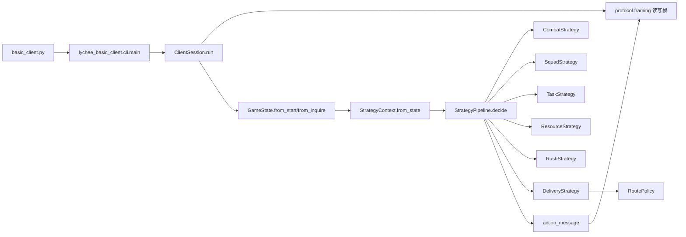

# 荔枝争运战比赛分析与当前 Python 客户端深度审阅报告

> 基于你上传的《参赛任务书》《通信协议》以及 GitHub 仓库审阅，我的结论是：这场比赛的核心不是单纯“跑得快”，而是“成功交付 + 至少做到 90 分普通任务基础分 + 正确处理阻挡/窗口/冲刺”的组合优化。当前仓库已经具备可运行的基础框架、分层模块和可合并动作的策略管线，但距离“高分稳定夺冠”还差四块关键能力：主动设卡、对手建模、任务组合优化，以及策略热切换与离线仿真。citeturn1view0turn6view0turn6view1turn14view0turn16view1

## 比赛全景与规则假设

先说结论：从你上传的任务书看，这是一场**双队、600 结算帧、以最终总分判胜**的贡运对抗赛。比赛并不是“谁先到 S15 谁赢”，而是围绕**交付、任务、鲜度、好果、悬赏、惩罚**共同结算。只追求极限速递，往往不是最优；只刷任务不交付，则会直接失去大头分数。

依据你上传的规则，我建议把这场比赛理解成四条并行主线：

| 主线 | 核心问题 | 对胜率/得分的影响 |
|---|---|---|
| 送达主线 | 能否在 S14 验核后于 S15 成功交付 | 决定是否拿到送达基础分、好果分、鲜度分、用时分，是压倒性的主分项 |
| 任务主线 | 是否能把普通任务基础分做到至少 90 | 决定送达基础分是否吃满、用时分是否不打折，也是任务分里程碑关键线 |
| 阻挡主线 | 障碍、设卡、强制通行、攻坚、窗口是否处理正确 | 决定路径是否被锁死、是否被拖慢、是否能制造或避免对手损失 |
| 冲刺主线 | 宫宴冲刺后验核、急策、宫门窗口怎么打 | 决定终盘谁更早交付、谁不会在门口被卡死 |

规则上，最重要的几个得分断点是：

| 断点 | 战略意义 |
|---|---|
| 完成交付 | 未交付时送达基础分、好果分、鲜度分、用时分都为 0，只剩缩水后的任务分和悬赏分 |
| 普通任务基础分达到 60 | 任务里程碑第一次抬升，任务分开始明显变厚 |
| 普通任务基础分达到 90 | 这是最关键断点：送达基础分吃满、用时分不再打折、任务分也显著提升 |
| 普通任务基础分达到 110 | 还有增益，但收益主要集中在任务分，不再继续抬高送达基础分与用时分 |

如果把任务书中的上限相加，理论正向总分上限是：

- 皇榜任务分 180
- 送达基础分 240
- 用时分 69
- 好果数量分 180
- 鲜度品质分 180
- 破关悬赏分 100

也就是说，**理论正向总分上限是 949 分**。反过来看，**未交付时任务分最多只按 80、悬赏最多只按 25 结算**，这意味着“没送到”的上限极低。因此，在不知道你当前真实地图和对手风格之前，我会把“稳交付 + 冲 90 任务基础分”视为一号大原则。

虽然你已经给了规则文档，但下面这些关键信息仍然没有被完全指定，因此我先按**开放式假设**处理：

| 未完全指定项 | 当前处理方式 |
|---|---|
| 你要打的是初赛地图、复赛地图还是决赛未知图 | 先按“可能存在已知首轮图，也可能存在未知决赛图”的双模式建策略 |
| 当前轮次真实 `start.map`、`nodes[]`、`edges[]`、`processNodes[]`、`resources[]` | 先按任务书公开规则建通用分析，不把站点写死到唯一一张图上 |
| 对手是偏速递、偏卡点、偏任务，还是混合流 | 先按常见四类对手套路建立反制框架 |
| 你现在本地代码与仓库主分支是否一致 | 先按 GitHub 仓库 `main` 分支做审阅 |
| 平台延迟、丢包、服务端实际事件字段细节 | 先按你上传的通信协议 V3 假设本地兼容 |

## 仓库现状与架构评审

从仓库 README、架构文档和源码看，这个仓库不是“只有一个能连上服务端的最小 TCP demo”，而是已经发展成一个**有策略管线、状态模型、日志与测试的比赛客户端骨架**。README 明确写到：项目演示了长度前缀分帧、`registration/start/ready/inquire/action` 全流程、空动作心跳、按动作类别合并主车队/小分队/窗口/急策动作；同时给出了 `protocol/runtime/models/events/strategies/rules/planning/observability/testing` 的职责分层。仓库入口 `basic_client.py` 仅做转发，真正启动链路是 `cli.main() -> ClientSession.run()`；运行依赖仅包含 Python 标准库，`requires-python` 为 `>=3.9`。citeturn1view0turn6view0turn7view0turn14view0turn14view1turn16view0turn16view2

当前架构可以用下面这张图概括：



这套设计的优点非常明确。

第一，**边界清晰**。`StrategyContext` 只暴露 `state + events summary`，说明作者已经意识到“策略不应直接与原始事件解析强耦合”。`GameState` 也把 `players / nodes / tasks / contests / weather / events / actionResults` 进行统一建模，至少在“读状态 → 做决策”的主线上是可维护的。citeturn12view9turn14view3

第二，**策略不是互斥切换，而是分类合并**。默认管线顺序是 `Combat -> Squad -> Task -> Resource -> Rush -> Delivery`，README 和 `strategy.md` 说明了同帧允许“主车队动作 + 小分队动作 + 窗口动作 + 急策额度”并存；`pipeline.py` 里也确实用 `_action_categories()`、`_action_priority()` 做冲突裁决，并给 `DELIVER / VERIFY_GATE / FORCED_PASS / CLEAR / BREAK_GUARD / PROCESS / CLAIM_TASK / MOVE` 等动作赋了明确优先级。这对比赛类 agent 来说是一个很好的基础。citeturn6view1turn13view2turn13view3turn13view4turn13view5

第三，**路由层已经不是纯写死脚本**。`RoutePolicy` 支持 `auto / first-round-water / first-round-safe / generic` 四种路由档位：`auto` 会先用首轮水路签名做匹配，匹配不上就退回动态图搜索；动态图搜索使用堆实现逐边最小代价搜索，并将天气、固定处理耗时、暴雨下水路站点额外处理、道路障碍、高额惩罚、残留税与敌方设卡防守值罚分都折进代价。这比很多比赛仓库常见的“只会 BFS 最短边数”要成熟得多。citeturn1view0turn14view2turn15view1turn12view8turn20view0turn20view1turn20view2turn20view3turn20view4

第四，**测试面比较全**。`tests/` 目录已经覆盖动作、分帧、模型、交付策略、管线、任务规划、天气路由、session smoke 等多个方向，说明这个仓库不是“纯手调脚本”，而是有一定可回归基础。citeturn19view0

但如果目标是“比赛拿高分”，当前实现仍有几个明显瓶颈。

| 维度 | 当前状态 | 风险 | 建议 |
|---|---|---|---|
| 主动设卡 | 协议层支持 `SET_GUARD`，但默认策略管线里没有独立 `GuardStrategy` | 丢掉主动干扰、悬赏制造、门口卡线能力 | 新增 `GuardStrategy` 与 `BountyStrategy` |
| 对手建模 | `StrategyContext` 只有状态与事件摘要，没有对手意图预测层 | 只能被动见招拆招，无法提前占资源/卡路/绕路 | 增加 `OpponentModel` 服务 |
| 决策接口 | 策略直接返回原始 action dict，缺少收益、风险、原因、前置条件 | 很难热切换、AB 测试、离线评估和自动调参 | 引入 `ActionProposal` |
| 交付模块 | `DeliveryStrategy` 既记忆已处理节点，又记忆任务拒绝、对象忙、被挡住目标，还负责检路、清障、攻坚、验核与交付 | 这是一个明显“越来越胖”的中心模块，后续很难维护 | 拆成 4 个子控制器 |
| 资源策略 | 默认只优先领取 `FAST_HORSE/SHORT_HORSE/ICE_BOX/INTEL`，并把情报目标硬编码为 `S11/S13/S14/S04/S05` | 文书和船权的争夺不足；在窗口高压图上会少一手 | 改成面向场景的资源价值评估 |
| 小分队策略 | 固定探路目标序列 `S04/S05/S11/S13/S14`，冲刺阶段停止新增 | 灵活性不够，无法针对敌方新卡点与新障碍做动态预埋 | 把小分队改成“候选目标打分器” |
| 参数管理 | 370 截止、75 安全边际、330 停止资源领取、520 才考虑疾行令等阈值写死 | 一旦地图和轮次变，参数可能不再最佳 | 参数配置化 + 离线批量调参 |

这些问题都能在源码中看到端倪：`ResourceStrategy` 将“值得拿的资源”写成固定元组，并硬编码情报目标；`RushStrategy` 把“是否用疾行令”压缩成少量固定阈值；`DeliveryStrategy` 内部维护 `_rejected_task_ids`、`_object_busy_nodes`、`_blocked_move_targets` 等状态集合，说明很多恢复逻辑已经集中到这一个类里；而协议层明明已经支持 `SET_GUARD / BREAK_GUARD / FORCED_PASS / WINDOW_CARD / SQUAD_* / RUSH_*` 全动作，但默认管线并没有把“主动设卡”做成一等策略。citeturn12view3turn17view0turn17view1turn17view7turn18view0turn18view2turn16view1turn4view0

我给你的具体重构建议是下面这套，优先级很高：

```python
from dataclasses import dataclass, field
from typing import Any, Protocol, FrozenSet

@dataclass(frozen=True)
class ActionProposal:
    action: dict[str, Any]
    categories: FrozenSet[str]
    priority: int
    expected_score_delta: float
    risk_cost: float
    reason: str
    tags: tuple[str, ...] = field(default_factory=tuple)

class DecisionModule(Protocol):
    def propose(self, ctx: "DecisionContext") -> list[ActionProposal]:
        ...
```

这个改法的意义在于：当前 `pipeline.py` 已经在做“类别 + 优先级”裁决，但信息是临时算的，且只存在于管线内部。把它提升成正式接口以后，你就能直接做：

- 策略热切换
- 不同策略包并行打分
- 对局复盘时看“为什么这个动作被压掉”
- 离线对比不同权重
- 加入“预期收益/风险/卡线价值/终盘价值”

然后，把 `DeliveryStrategy` 拆成四层，而不是继续往一个大类里塞判断：

```python
class ProcessTracker:
    def should_process_here(self, ctx): ...
    def observe_events(self, ctx): ...

class BlockResolver:
    def resolve_next_hop_block(self, ctx, target_node_id): ...
    # 返回 CLEAR / CLAIM_TASK(T04) / BREAK_GUARD / FORCED_PASS / reroute

class EndgameController:
    def decide_gate_or_delivery(self, ctx): ...
    # 返回 VERIFY_GATE / DELIVER / move back to S14 / wait

class GoalPlanner:
    def choose_primary_goal(self, ctx): ...
    # 返回 "TASK_90", "DELIVER", "BOUNTY", "DISRUPT"
```

为什么我建议你这样拆？因为现在仓库已经证明它具备“按类别合并动作”的能力，也已经有 `RoutePolicy`、`StrategyContext`、`GameState` 等基础设施；真正缺的是把“目标规划、阻挡处理、终盘控制、对手控制”拆成可替换决策器，而不是继续把它们都堆到 `DeliveryStrategy` 里。citeturn12view2turn18view0turn18view5turn12view7turn13view2

## 规则资产盘点

这一节我把你关心的“技能、事件、道具、 buff 等一切信息”统一整理成可决策的资产表。这里我先说明一个术语问题：**任务书并不主要使用“技能”这个词，比赛里的可决策资产更准确地分成动作、资源、窗口牌、急策、增益、天气、任务、事件与状态。**

### 资源、道具与增益

| 类别 | 名称 | 作用 | 战略影响 |
|---|---|---|---|
| 保鲜资源 | 冰鉴 `ICE_BOX` | 鲜度 +10，上限 100；鲜度为 0 时不可用 | 终盘保分核心，尤其关乎鲜度分和好果转坏速度 |
| 移动资源 | 快马 `FAST_HORSE` | 20 帧移动加速 | 适合长段路线或中后段赶时间 |
| 移动资源 | 短程马 `SHORT_HORSE` | 14 帧移动加速 | 更适合补短程接驳或任务抢点 |
| 特殊资源 | 船权 `BOAT_RIGHT` | 码头标记，可领不可主动使用 | 具体取决于地图配置与窗口语义，通常是水路权益信号 |
| 文书资源 | 过所 `PASS_TOKEN` | 支付窗口牌 `YAN_DIE` | 影响资源/任务/处理窗口的文书博弈能力 |
| 文书资源 | 官凭 `OFFICIAL_PERMIT` | 同上 | 与过所一起构成“验牒”支付能力 |
| 情报资源 | 情报 `INTEL` | 给近距离节点加探路标记，相关处理 -3 帧，最低 2 帧 | 极高价值的节拍资源，能提前压缩 S04/S05/S11/S13/S14 关键读条 |
| 点数 | 护卫行动点 | 支付窗口牌 `BING_ZHENG` | 是窗口强压制资源，且初始仅 4 点不恢复 |
| 编制资源 | 小分队人手 | 派小分队探路/清障/增援/削弱 | 用来把主车队之外的“并行动作”做起来 |

当前仓库对这些资源的利用并不完整：它在资源策略里优先考虑的只是 `FAST_HORSE / SHORT_HORSE / ICE_BOX / INTEL`，说明“文书资源主动囤积”与“码头权益资源建模”还没有成为默认高优先级。可惜的是，窗口策略一旦已经拥有文书，又会优先在满足条件时打出 `YAN_DIE`。这说明**仓库已经具备“花文书”的能力，但不具备“为花文书而主动备货”的能力**，这是一个非常具体、而且很值得你补的缺口。citeturn12view3turn17view0turn17view1turn17view8

协议与状态层对 buff 的表示也比较清楚：`FAST_HORSE`、`SHORT_HORSE`、`RUSH_SPEED` 都属于移动类增益，`RUSH_PROTECT` 属于鲜度减损类增益；仓库的 `rules/buffs.py` 目前也只显式识别了移动 buff 与保护 buff 两类。citeturn15view2turn16view1

### 窗口牌与终局急策

| 类别 | 名称 | 成本 | 效果/用途 | 典型使用时机 |
|---|---|---|---|---|
| 窗口牌 | `YAN_DIE` | 1 文书资源 | 文书压制牌 | 资源/任务/处理争夺中，对文书对局有优势时 |
| 窗口牌 | `QIANG_XING` | 有马/疾行时可免成本，否则要消耗马类 | 速度牌 | 你已具备加速资产，又要抢节奏时 |
| 窗口牌 | `XIAN_GONG` | 鲜度≥80 且消耗 1 好果 | 鲜贡牌 | 中前期高鲜度且好果充足时很好用 |
| 窗口牌 | `BING_ZHENG` | 1 护卫行动点 | 压制性很强 | 关键窗口优先用，尤其宫门或高分任务 |
| 窗口牌 | `ABSTAIN` | 无 | 弃权 | 明知本拍不值得打时止损 |
| 急策 | `RUSH_SPEED` | 2 好果 | 15 帧推进提升 30%，鲜度损耗 ×1.25 | 冲刺期、路线边、时间真的紧时 |
| 急策 | `RUSH_PROTECT` | 无果品成本 | 30 帧鲜度损耗 ×0.2 | 鲜度很危险、而距离终点还够长时 |
| 急策 | `BREAK_ORDER` | 坏果优先，否则 1 好果 | 攻坚 +3 或验核 -3 帧 | 关键关隘攻坚、S14 验核压缩 |

从规则价值看，窗口牌不是“可有可无的小机制”，而是**争取对象控制权**的正式博弈层。终局急策则是**每局一次的资源再分配**：你只能在速度、保鲜、破关缩时之间三选一，所以它必须和你整局路线意图一致，不能临时拍脑袋。

当前仓库的终局急策选择偏保守：`RushStrategy` 只在冲刺阶段、路线边、没开过急策、没有移动 buff、好果大于 2，且估算交付较紧时给 `RUSH_SPEED`；`BREAK_ORDER` 则只在验核里绑定使用；`RUSH_PROTECT` 暂未主动策略化。这种实现非常稳，但会在某些“鲜度比时间更危险”的局面下损失上限。citeturn6view1turn12view6turn17view7turn18view1

### 任务、阻挡与小分队

普通任务模板如下：

| 高价值任务 | 分值 | 处理帧数 | 备注 |
|---|---:|---:|---|
| T01 / T02 / T04 / T06 / T08 / T11 | 30 | 3-6 | 是冲 90 分任务基础分的核心集合 |

| 次级任务 | 分值 | 处理帧数 | 备注 |
|---|---:|---:|---|
| T12 / T13 / T14 | 15 | 5 | 更适合补线或凑整，不适合大绕路 |

这里最关键的规则洞察只有一句话：**如果要追任务，优先追 30 分任务；如果已经靠近 90，则要按“补足断点”思路选最短路径的那个。** 因为 90 分是决定送达基础分和用时分是否吃满的核心阈值，而不是 110。

阻挡系统有三类：

| 阻挡/对抗机制 | 本质 | 我方可用解法 |
|---|---|---|
| 道路障碍 | 阻止普通 MOVE 进入 | `CLEAR` / T04 / `SQUAD_CLEAR` / `FORCED_PASS` / 绕行 |
| 敌方设卡 | 阻止通行并可形成悬赏 | `BREAK_GUARD` / `FORCED_PASS` / `SQUAD_WEAKEN` / 等其风化 |
| 窗口争夺 | 对同一个对象的控制权博弈 | 备文书、备鲜度、备护卫点、选择合适出牌 |

小分队则是四个并行动作：

| 小分队动作 | 消耗 | 作用 | 最适合做什么 |
|---|---:|---|---|
| `SQUAD_SCOUT` | 1 人 | 远程加探路标记 | 提前压缩 S04/S05/S11/S13/S14 读条 |
| `SQUAD_CLEAR` | 2 人 | 远程清障 | 把主车队主线上的障碍提前拆掉 |
| `SQUAD_REINFORCE` | 2 人 | 我方设卡防守 +2 | 围绕 S10/S11/S14 卡点时使用 |
| `SQUAD_WEAKEN` | 2 人 | 敌方设卡防守 -2 | 对手在关键关隘布防时非常强 |

仓库当前默认小分队逻辑是：普通阶段才新增、优先削弱主线上的敌方设卡，再清障，否则按 `S04 -> S05 -> S11 -> S13 -> S14` 固定次序探路。这种思路适合稳健送达，但还不够“比赛型”，因为它缺少“根据敌方走位与我方 ETA 估计小分队投放”的动态性。citeturn6view1turn12view5turn17view5turn17view6

### 天气、状态与事件

天气是会改变最优路线的，不是背景噪音：

| 天气 | 核心影响 | 战略含义 |
|---|---|---|
| 酷暑 `HOT` | 全图鲜度损耗上升 | 对保鲜压力大，冰鉴/护果令价值上升 |
| 暴雨 `HEAVY_RAIN` | 水路移动变慢，登船/水路换运处理 +4 | 水路不再绝对优，必要时应切陆路 |
| 山雾 `MOUNTAIN_FOG` | 山路移动变慢，小分队探路延迟 +2 | 山路线和探路线的收益下降 |

玩家状态则决定你本帧能不能动：

| 状态 | 关键影响 |
|---|---|
| `IDLE` | 可正常决策 |
| `MOVING` / `WAITING` | 只能继续当前段、改道或用马类/疾行令 |
| `PROCESSING` / `VERIFYING` / `FORCED_PASSING` | 不要瞎下主车队动作，等结算 |
| `CONTESTING` | 重点转去打窗口牌 |
| `RESTING` | 只等，不要误送动作 |
| `DELIVERED` | 基本冻结，只允许等待/重复交付 |
| `RETIRED` | 本局已结束 |

事件层极其重要，因为这场比赛不是“发了动作就算成功”，而是 `events[] + actionResults[] + 下一帧公开状态` 三者联合判定。最值得策略层主动监听的事件簇，我建议至少分成下面几组：

| 事件簇 | 代表事件 |
|---|---|
| 位置与流程 | `MOVE_PROGRESS`、`NODE_ENTER`、`PROCESS_PROGRESS`、`PROCESS_COMPLETE` |
| 任务 | `TASK_REFRESH`、`TASK_COMPLETE`、`TASK_EXPIRE`、`TASK_TARGET_LOST` |
| 资源 | `RESOURCE_CLAIM`、`RESOURCE_USE` |
| 窗口 | `WINDOW_CONTEST_START`、`WINDOW_CARD_REVEAL`、`WINDOW_CONTEST_END`、`WINDOW_CONTEST_DRAW` |
| 阻挡 | `GUARD_SET`、`GUARD_BREAK`、`OBSTACLE_CLEAR`、`FORCED_PASS_START`、`FORCED_PASS_END` |
| 终局 | `RUSH_START`、`RUSH_TACTIC_USE`、`VERIFY_GATE_COMPLETE`、`DELIVER_SUCCESS` |
| 风险警报 | `ACTION_REJECTED`、`INVALID_ACTION`、`BUFF_OVERWRITE`、`POST_DELIVER_PENALTY`、`DISCONNECT_WARNING` |

这一点和仓库的运行时实现是对齐的：`ClientSession` 每帧就是在记录 `events[]`、`actionResults[]` 和下一帧状态；而 README 也强调不能只看上行 action 是否 accepted，要看服务端真实事件与状态变化。citeturn14view0turn1view0

## 高分策略设计

先给你一句最重要的话：**这场比赛“得分最高”的策略，几乎不可能是一个固定脚本，而应该是“底座策略 + 地图模式 + 对手模式”的组合。** 结合规则与当前仓库实现，我建议你准备四套策略，其中前三套必须实现，第四套作为进阶对抗方案。

### 策略对比总表

| 策略 | 目标 | 最适合的局面 | 任务目标 | 资源优先级 | 对手干扰应对 | 风险 | 上限 |
|---|---|---|---|---|---|---|---|
| 稳健九十分送达流 | 稳定交付并尽快做到 90 任务基础分 | 未知对手、未知图、需要稳分晋级 | 优先 3 个 30 分任务 | 冰鉴 > 马 > 情报 > 文书 | 被挡就 T04/清障/强通，不卷无意义窗口 | 低 | 很高 |
| 首轮水路线极速流 | 利用已知首轮水路线压用时和鲜度 | 当前地图签名匹配首轮水路 | 路上拿满或接近 90 | 快马/短马/情报 > 冰鉴 | 针对 S10 卡点准备 break/force 预案 | 中 | 最高 |
| 未知图自适应保鲜流 | 在天气/障碍不利时保鲜稳交付 | 决赛图、暴雨图、敌方强干扰图 | 先 60，再视 ETA 决定冲 90 | 冰鉴/护果资源思维优先 | 主打绕行与状态管理，避免休整链 | 中低 | 高 |
| 关隘反制悬赏流 | 在稳交付底座上，主动制造对手损失 | 你能预判对手主线，且自己已不落后 | 自己先锁 90，再转干扰 | 文书/护卫点/小分队/坏果 | S10/S11/S14 设卡、增援、悬赏、窗口压制 | 高 | 极高但波动大 |

### 稳健九十分送达流

这是我最推荐你立刻做成比赛主力的一套，因为它和当前仓库的默认思路最接近，落地成本最低。

**目标**  
先确保交付，再把普通任务基础分稳定拉到 90，尽量不在 110 以后做高风险绕路。

**触发条件**  
适用于你还不清楚对手强度、地图不是完全熟悉、或你需要先确保不翻车的时候。

**关键决策点**  
核心不在“见任务就接”，而在“这个任务做完后，交付仍然安全吗”。当前仓库其实已经在做这件事：任务规划层用 `TASK_CUTOFF_ROUND = 370` 和 `DELIVERY_SAFETY_MARGIN = 75` 控制是否继续追任务，同时在任务分达到 110 后停止继续追。这个方向是对的，只是还可以更精细一些。citeturn15view0turn6view1

**技能/资源优先级**  
高优先级顺序建议是：

1. 路上线 30 分任务
2. 冰鉴与马类
3. 情报给关键处理点
4. 必要时争取文书
5. 冲刺期再决定是否开急策

当前仓库资源策略会优先拿 `FAST_HORSE / SHORT_HORSE / ICE_BOX / INTEL`，这套策略正好与之相容。citeturn17view0turn12view3

**对手干扰应对**  
面对障碍，优先看能不能顺手吃 T04；吃不到再考虑 `CLEAR`；如果会严重拖终盘，就直接 `FORCED_PASS`。这也是当前 `DeliveryStrategy` 的主线逻辑。citeturn17view9turn18view2

**风险与收益**  
风险低，收益非常高，尤其适合 Swiss 赛制、积分赛和晋级赛。它的天花板不一定是全场最高，但**综合胜率通常最高**。

### 首轮水路线极速流

如果你确认当前对局仍是仓库识别的“首轮固定水路线签名”，这套往往是最高上限方案。

**目标**  
利用水路更优的基础耗时与更低鲜度损耗，尽早完成 S14 验核并在交付前抢够 90 普通任务基础分。

**触发条件**  
真实地图签名与仓库内 `FIRST_ROUND_WATER_ROUTE` 匹配，且暴雨窗口不把水路价值打穿。

**关键决策点**  
- S02 必做前段交接
- S04/S05 必须围绕登船与水路换运读条优化
- S09/S10 是关键风险点，既可能有障碍，也可能被设卡
- 若暴雨命中水路且 S04/S05 读条被显著拉长，就要动态比较是否改走陆线

仓库当前支持“签名匹配首轮水路线”与“匹配失败退回动态搜索”，说明这套策略可以直接建立在现有 `RoutePolicy` 之上。citeturn6view1turn12view8turn15view1turn20view2

**技能/资源优先级**  
短程马、快马、情报要前置；尤其情报对 S04/S05/S11/S13/S14 的读条压缩价值很高。当前资源策略和小分队策略已经在朝这个方向工作，但还不够积极。citeturn17view1turn17view6

**对手干扰应对**  
S10 如果被卡，优先依据剩余时间判断是 `BREAK_GUARD` 还是 `FORCED_PASS`。当前代码在 guard 防守值可一次打穿且交付余量足够时倾向 `BREAK_GUARD`，否则 `FORCED_PASS`，这是合理基线。citeturn17view9

**风险与收益**  
这是上限最高的路线型策略，但受暴雨、水路处理点争夺、S10 关隘压制影响比较大。若你对首轮图熟悉，它会比稳健流更强。

### 未知图自适应保鲜流

这套是给决赛未知图和高干扰局准备的。

**目标**  
不执着于固定路线，围绕“鲜度不崩、交付不丢、任务做到 60 或 90 即止损”进行动态重规划。

**触发条件**  
适用于 `--route-profile=generic`、暴雨频发、障碍和设卡都重、而你又没有足够地图先验的时候。

**关键决策点**  
- 把天气、处理点、阻挡、残留税、风化后防守值一起纳入路线价值
- 降低不必要的窗口参与率
- 当鲜度压力明显高于时间压力时，考虑把唯一急策从 `RUSH_SPEED` 改成 `RUSH_PROTECT`

当前仓库动态图搜索已经把天气倍率、暴雨水路处理加时、障碍高惩罚、残留税和 guard 罚分纳入 `_edge_cost`，所以它天然适合做这套策略的底座。缺的是“鲜度风险显式打分”和“护果令主动规划”。citeturn20view0turn20view1turn20view2turn20view3

**技能/资源优先级**  
冰鉴与护果思维优先，其次是情报与路上可顺手拿的马类。

**对手干扰应对**  
这套不追求硬拼，而是“少进窗口、少进休整、少被链式拖慢”。如果对手强堵关键点，你要更愿意早绕路，而不是在一个点上来回纠缠。

**风险与收益**  
风险不高，上限略低于“首轮水路极速流”，但**在未知图上更稳**。

### 关隘反制悬赏流

这是你如果想冲榜、抢 BO3/BO5 对抗优势，必须准备的进阶方案。但我坦白说，它**目前不适合直接建立在现有仓库默认实现上**，需要你先补主动设卡与对手建模。

**目标**  
在自己已能稳定交付、且已接近或达到 90 任务基础分后，把部分资源转成“关键关隘拖慢对手 + 制造悬赏 + 宫门博弈优势”。

**触发条件**  
- 你预判对手主线大概率经过 S10/S11/S14
- 你自己在节奏上不落后
- 你还保有足够小分队、文书、护卫点、果品或坏果

**关键决策点**  
- 哪个点值得设卡：S10 > S11 > S14，通常是这个顺序
- 设卡之后要不要小分队增援
- 悬赏是否值得为了“自己落后时反超”特意去做
- 对方如果开始强通，是打窗口、让他进休整，还是提前削薄他资源

仓库协议层已经支持 `SET_GUARD`、`BREAK_GUARD`、`SQUAD_REINFORCE`、`SQUAD_WEAKEN`，但默认策略层没有相应的主动模块，所以这套策略目前是“能力具备，决策缺位”。citeturn16view1turn4view0turn1view0

**技能/资源优先级**  
文书、兵争、坏果、小分队人手、关键点位的情报都要上升。

**对手干扰应对**  
如果对手也转干扰战，这套比的就不是“会不会卡”，而是“谁更早准备、谁更懂窗口与悬赏触发条件”。

**风险与收益**  
风险最高，但在高水平对抗里很可能决定胜负。我的建议是：**把它作为第二阶段增强包，而不是第一阶段主力。**

## 对手动作与反制

你特别提到“要考虑对手可能竞争、设卡、给我们做局”。这一点非常关键。比赛里真正会拉开高低手差距的，不是你知不知道规则，而是你是否把对手当成“主动优化器”去建模。

我建议你预设下面五类常见对手：

| 对手类型 | 常见动作 | 你的主要损失 | 建议反制 |
|---|---|---|---|
| 任务抢点型 | 早抢 30 分任务、任务窗口强压 | 你达不到 90 断点 | 优先抢路上 30 分任务；对已被保护任务立刻放弃，换目标 |
| 资源封锁型 | 抢马、抢情报、抢文书 | 你移动优化和窗口牌质量下降 | 对 S04/S09/S13 文书点和马点做更高优先级预占 |
| 关隘设卡型 | 在 S10/S11/S14 设卡并增援 | 你节奏断层、被迫强通/攻坚 | 预埋小分队削弱、保留坏果、判断何时直接强通 |
| 窗口压制型 | 护卫点/鲜贡/文书充足，敢连续打窗口 | 你读条和关键对象控制权丢失 | 关键窗口前必须有至少一种强牌支付能力，不然就错峰 |
| 终盘冲刺型 | RUSH 开得早、门口绑破关令 | 你在 S14/S15 被反超 | 不要把唯一急策太早浪费；宫门前至少预留一种应急方案 |

结合规则和当前仓库，我认为你需要特别注意下面几个“高频阴招”。

**任务做局**  
对手会故意和你抢同一类 30 分任务，让你为了冲 90 在错误时间绕路。正确做法不是“死磕某个任务”，而是建立**任务组合视角**：以 90 为目标断点，选最短完成组合，而不是只看单任务分值。

**S10/S11 设卡连锁**  
这是最典型也最危险的对抗点。因为这些点既影响主线，又能挂接攻坚、强通、悬赏和小分队操作。你不能只把它理解为“有 guard 就 break”，而要根据：
- 你当前是否已经够 90
- 剩余鲜度和好果
- 对手总分是否领先
- 是否存在可拿悬赏
- 你的坏果是否足够支撑 `BREAK_ORDER`

来决定是打、绕还是强通。

**门口窗口与重复平局**  
S14 的窗口不是普通对象争夺，它直接关系到交付窗口期。如果你在宫门连打平局，可能把自己节奏完全拖死。当前仓库已经把 `BREAK_ORDER` 绑定到 `VERIFY_GATE` 的思路写进了交付策略，这说明作者意识到了“宫门缩时是一件大事”；你下一步要做的是把“门口窗口的备牌与资源预算”也前置到策略规划层。citeturn18view1turn18view3

**隐藏阻挡与错误恢复**  
这类局面最怕客户端在同一个被卡节点上连续重复发失败动作。当前 `DeliveryStrategy` 已经会把被 `MOVE_BLOCKED_BY_GUARD / MOVE_BLOCKED_BY_OBSTACLE / BLOCKED` 拒绝过的目标加入 `_blocked_move_targets`，后续改为更激进的阻挡处理动作，这一点非常有价值，你要保留并继续强化。citeturn18view2

如果要把“对手建模”真正落到代码里，我建议你至少引入下面这个结构：

```python
@dataclass
class OpponentIntent:
    likely_route: list[str]
    likely_task_target: str | None
    likely_guard_targets: tuple[str, ...]
    window_pressure: float
    rush_ready: bool

class OpponentModel:
    def update(self, state, events) -> None: ...
    def predict(self, opponent_id: int) -> OpponentIntent: ...
```

这样你才能做出真正比赛级的判断，例如：

- “对手 3 帧后大概率进 S10，我现在的小分队削弱要不要提前发”
- “对手已经没有文书，我这次资源窗口是不是不必出兵争”
- “对手总分高于我，打下这个悬赏值不值得”

## 分阶段开发计划

下面这套计划是按“先能打、再高分、再对抗”排序的。你如果准备比赛，我建议严格按照这个先后顺序做，不要一开始就沉迷终极花活。

| 阶段 | 目标 | 主要开发任务 | 测试方法 | 验收标准 | 预估工时 | 优先级 |
|---|---|---|---|---|---:|---|
| 基线固化 | 先把当前版本跑稳 | 拉通 README 指定启动方式；记录 5 局日志；确认能完整收发与不断线 | 本地协议联调、`py_compile`、`unittest discover` | 5 局无掉线、无 framing 错误、无明显非法动作堆积 | 4-6h | 最高 |
| 决策可观测化 | 让每个动作“可解释” | 在 pipeline 前后加决策原因、候选方案、被压掉原因日志 | 回放日志人工审查 | 每帧能看出“为何选此动作、为何没选彼动作” | 6-8h | 最高 |
| 任务组合优化 | 从单任务贪心变成 90 分断点优化 | 改造 `planning/tasks.py`，做组合/断点评估 | 离线回放 + 枚举小地图样例 | 90 分断点命中率显著提升 | 10-14h | 高 |
| 资源策略升级 | 从“固定拿四类”升级到“场景化拿资源” | 加文书、船权、门口资源预算；把 `INTEL` 投放改成 ETA 驱动 | 对比回放日志 | 关键窗口前文书与情报更充足，非法资源用法不增加 | 8-12h | 高 |
| 交付模块拆分 | 降低 DeliveryStrategy 复杂度 | 拆成 ProcessTracker / BlockResolver / EndgameController | 单元测试 + 回归测试 | 行为等价或更优，类职责更清晰 | 10-16h | 高 |
| 对手建模与设卡 | 增加真正的比赛对抗能力 | 新建 `GuardStrategy`、`OpponentModel`、`BountyStrategy` | 构造对手脚本做对抗样例 | 能主动卡 S10/S11/S14，并避免自爆交付 | 14-20h | 中高 |
| 仿真调参与赛前冻结 | 找稳定参数 | 批量回放、参数扫描、固定比赛配置 | 多组对局统计 | 选出主策略/备策略/地图模式切换条件 | 10-16h | 中高 |

当前仓库本来就有一批测试目录可复用，所以你的开发方式不应该是“改完就上场”，而应该是“每改一个策略模块，就补一个对应测试场景”。特别建议你继续扩充下面这几类测试：

- `test_strategy_pipeline.py`：验证同帧多类别动作合并是否符合预期  
- `test_delivery_strategy.py`：验证门口、终点、阻挡、T04 分支  
- `test_task_planning.py`：验证 90 断点优先而不是单任务最高分优先  
- `test_weather_events_routing.py`：验证暴雨/山雾下是否切路  
- 新增 `test_guard_strategy.py`、`test_opponent_model.py`、`test_break_order_policy.py`  

这些测试方向和仓库现有测试布局是匹配的。citeturn19view0

## 仍需你补充的信息

虽然我已经能给出一版较完整的比赛分析，但如果你希望我下一轮把策略细化到“具体站点、具体动作时机、具体代码改哪几行”的级别，你还需要再给我下面这些信息。它们里面有些是规则文档中“本局动态决定”的内容，不补的话，我只能做通用最优，而做不到“你这一轮比赛的特化最优”。

| 你需要补充的内容 | 为什么重要 | 我会如何使用 |
|---|---|---|
| 本轮真实 `start` 包样例 | 决定地图、资源点、任务模板、处理点、天气区域真实配置 | 做当前轮次的专用路线和任务组合 |
| 至少 3 局 `inquire`/日志样本 | 可以看到你目前策略哪里掉分、哪里吃拒绝、哪里被卡 | 做行为级复盘与参数修正 |
| 你要参加的是哪一轮比赛 | 初赛/复赛/决赛对“已知图/未知图”的策略差异很大 | 决定是否主打固定路线还是 generic |
| 你实际遇到的主要对手风格 | 对手如果全是速递流，和全是卡点流，反制完全不同 | 做对手模板权重 |
| 你现在本地代码是否就是 GitHub 主分支 | 如果你已有本地改动，我需要按真实代码而不是仓库 HEAD 分析 | 给出更精准的重构建议 |
| 你是否允许我按“重构优先”还是“比赛前最小改动优先”来设计 | 两种路线差别很大 | 决定是补新模块还是只改阈值和策略顺序 |
| 你本地测试结果 | 我不能在线代跑你的本地环境 | 根据你返回的日志继续做针对性调参 |

如果你下一步补给我**本轮 start/inquire 样本、你最近几局日志、以及你当前本地代码与仓库是否一致**，我就可以继续把这份报告收敛成更具体的版本：  
一是把四套策略进一步缩成“主策略 + 两套备选”；  
二是直接给你列出应当修改的类、函数与判定条件；  
三是把“什么时候开 RUSH_SPEED、什么时候用 BREAK_ORDER、哪里值得主动设卡”细化成对局脚本级建议。