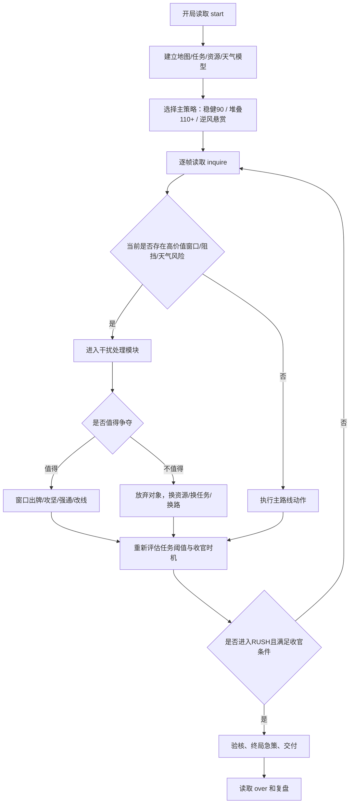
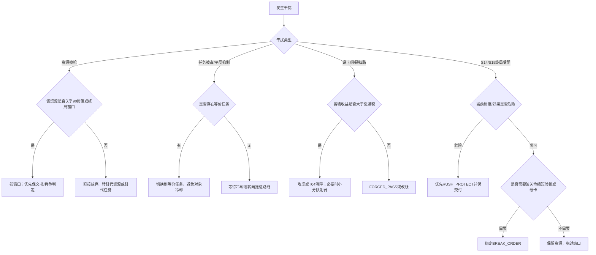

# 一骑红尘：荔枝争运战比赛分析报告

## 执行摘要

根据你上传的两份原始资料，这场比赛并不是传统的离线算法题，而是**双队实时对抗的策略编程赛**：红蓝双方各控制一支贡运队，在最多 600 个结算帧内，从岭南出发，将荔枝运抵长安兴庆宫，并通过**任务分、送达分、用时分、好果分、鲜度分、破关悬赏分**争取更高总分；开局双方都拥有 100 篓好果、鲜度 100、8 名人手和 4 点护卫行动点。比赛通过 TCP Socket 进行 C/S 通信，客户端必须处理 5 位长度前缀、粘包/半包问题，并按 `registration -> start -> ready -> inquire/action -> over` 的回合节奏行动。换言之，你真正要做的是一个**稳定通信 + 状态机 + 路线规划 + 对抗博弈 + 风险控制**的一体化策略客户端，而不是只写一个寻路函数。 [任务书 §1.1-1.5，L22-L24、L42-L91；协议 §1-2，L107-L149、L151-L189]

从计分结构看，最关键的战略门槛不是“尽快到终点”本身，而是**先把普通皇榜任务基础分做上去**。因为普通任务基础分不仅计入“皇榜任务分”，还直接决定“送达基础分”是否满额，以及“用时分”是否被折减；其中 **90 分任务基础分**是首个必须重视的硬阈值，达到 90 后送达分封顶 240、用时系数也达到 1；**110 分**是第二个高价值阈值，因为里程碑奖励总额提升到 +50 中的主要部分；**130 分**基本对应任务分封顶 180。换句话说，纯速通不是高分答案，**“至少做够 90 的任务基础分，再兼顾鲜度和剩余好果”**才是稳健高分主线。 [任务书 §7.2，L1197-L1232]

从对抗结构看，比赛的难点不在单纯移动，而在于**争抢窗口、障碍/设卡、强制通行、探路减时、终局急策**这几层叠加。窗口争夺是 3 拍对局，资源、任务、固定处理、宫门验核、清障与强制通行都可能触发窗口；设卡与障碍又会改变你的路径选择和时间税；宫宴冲刺阶段后，宫门验核和终局急策会把比赛拉入一轮高压收官。你要准备的不只是“最短路”，而是一个能在**抢资源、抢任务、抢路权、抢终点窗口**中不断切换策略的博弈系统。 [任务书 §5.4，L726-L838；§6.1-6.5，L850-L1176]

如果你现在要立刻进入备赛，我建议把工作优先级排成四层：**先做稳定通信和状态解析；再做合法动作引擎；然后做任务/资源/窗口的基础策略；最后做对手建模与应急决策树**。在没有更多额外信息前，我会把你的最佳备赛方向定为三套策略并行准备：**九十分任务均衡速交流、任务堆叠高上限流、悬赏反打逆转流**。这三套策略分别对应“稳、高、翻盘”三种比赛态。 [协议 §1-2，L107-L149、L151-L189；任务书 §4-7，L544-L679、L680-L838、L850-L1263]

## 比赛画像与核心目标

这场比赛的名称已经由你上传的文档明确给出：**《一骑红尘：荔枝争运战》**。赛事本质是一个**帧推进、双边公开状态、带随机天气和地图变体的实时对抗程序赛**。地图、资源点、任务模板、节点与边的初始信息在 `start` 中下发，之后每帧通过 `inquire` 给出玩家状态、站点状态、天气、任务、悬赏、窗口、事件和动作结果；因此你的程序既要“会规划”，也要“会读局”。 [任务书 §1.2，L26-L29；§2.2，L124-L151；§2.6，L338-L380；协议 §5、§7，L341-L603、L712-L730]

下图对应任务书中的对战面板示意，强调的是：**比分、阶段、任务、窗口、天气、事件通知都属于公开信息**，但完整未来天气、未进预告期天气、未来任务和敌方尚未公开的本帧动作不提前公开。你在程序里必须围绕这些“公开但不完备”的信息做决策。 [任务书 §2.6，L340-L380]

把比赛的核心事实压缩成一句话，就是：**在 600 帧内，用尽可能高质量的荔枝、在尽可能合适的时机，完成尽可能多且价值合适的任务，并在必要时压制或绕开对手的干扰。** 其中，“高质量”对应剩余好果和鲜度，“合适时机”对应用时分和窗口/天气节奏，“价值合适的任务”对应 90、110、130 这些任务阈值。 [任务书 §1.4，L68-L74；§7.1-7.2，L1183-L1232]

基于附录 A 的“初赛默认地图”，如果**只按静态路线距离 + 必经固定处理**做粗略推算，且**忽略天气、争夺窗口、障碍、设卡、资源抢夺与地图变体**，那么官方初赛图上有三条很值得你脑中先建立的“基线路线画像”。这里的数字是我依据附录 A 的路线距离、处理点和移动公式做的推算，不是官方直接给出的到达帧数，因此只能当作战略直觉，不能写死进程序。 [任务书 §2.3.2，L177-L219；协议 附录A，L1695-L1779]

| 基线路线 | 经过节点 | 静态推算总帧数 | 观察 |
|---|---|---:|---|
| 山路直冲线 | S01→S06→S08→S10→S11→S12→S13→S14→S15 | 约 416 | 处理点少，理论最短，但吃山路高鲜度损耗，且 S06/S08 常是障碍与争夺焦点 |
| 水路折中线 | S01→S02→S04→S05→S09→S10→S11→S12→S13→S14→S15 | 约 426 | 移动耗损较低，且可拿船路相关资源，但处理站较多 |
| 官道主线 | S01→S02→S03→S07→S09→S10→S11→S12→S13→S14→S15 | 约 444 | 节点资源/任务相对顺手，但整体更慢，容易被对手在关键节点拦截 |

从战略含义看，**山路线偏“快”、水路线偏“稳”、官道线偏“任务和资源顺手”**。真正的最优路线并不固定，因为规则明确写明晋级过程中会使用不同地图变体，正式对战必须以 `start.nodes[]`、`start.edges[]`、`map.gameplay` 和实时 `inquire` 为准，而不能硬编码默认图。 [任务书 §2.2，L137-L151；协议 附录A，L1695-L1697]

## 规则体系与机制拆解

### 动作与技能体系

官方文档并没有把系统叫作“技能系统”，但如果站在实战分析角度，完全可以把**主车队动作、小分队动作、窗口牌和终局急策**看作四类“技能”。同时要特别注意：这套规则**几乎没有传统意义上的冷却时间**，更多是用**处理帧、状态锁定、每帧类别上限、窗口拍数、整局次数限制**来约束行动。 [任务书 §4.1，L544-L558；§6.4-6.5，L1079-L1176；协议 附录E，L2153-L2505]

下表按“技能”视角重整官方动作；“实战优先级”是分析判断，不是官方字段。 [任务书 §4.1-4.5，L544-L679；§6.1-6.5，L850-L1176；协议 附录E，L2153-L2505]

| 技能 | 类别 | 成本/限制 | 持续/耗时 | 触发条件 | 实战优先级 |
|---|---|---|---|---|---|
| `MOVE` | 主车队 | 每帧主车队动作 1 次；必须到合法相邻节点 | 按路线距离、路线类型、天气计算 | 当前节点无未完成固定处理，目标无阻挡 | 极高 |
| `WAIT` | 主车队 | 无资源成本 | 1 帧；移动中会暂停推进 | 任意允许等待状态 | 中 |
| `PROCESS` | 主车队 | 无直接资源成本 | 依站点类型而定 | 当前节点有普通处理流程 | 高 |
| `CLAIM_RESOURCE` | 主车队 | 指定目标节点和资源类型 | 领取帧数通常 2 帧 | 主车队在资源点、库存存在 | 很高 |
| `USE_RESOURCE` | 主车队 | 消耗库存资源 | 多数当帧生效 | 节点上可用；移动中通常仅马类可用 | 很高 |
| `CLAIM_TASK` | 主车队 | 指定任务实例 ID；同一时间只能处理 1 个任务 | 3–6 帧不等 | 在目标任务合法站位；T04 允许相邻节点 | 极高 |
| `CLEAR` | 主车队 | 启动冻结 1 篓好果，完成后扣除 | 6 帧 | 目标障碍在当前节点或相邻节点 | 中高 |
| `SET_GUARD` | 主车队 | 4 帧；可额外投 0/1/2 好果；同时最多保留 2 个有效设卡 | 4 帧，完成后次帧起拦截 | 当前节点可设卡，S15 禁止 | 中高 |
| `BREAK_GUARD` | 主车队 | 好果每篓 +2 攻坚值，坏果每篓 +3；各自最多投 2 | 无额外读条；失败休整 5 帧 | 相邻节点存在敌方有效设卡 | 很高 |
| `FORCED_PASS` | 主车队 | 只对本次通行有效；不清除阻挡 | 强制通行总需求帧 = 路线耗时 + 时间税 | 相邻目标存在有效设卡或障碍 | 高 |
| `VERIFY_GATE` | 主车队 | 仅 RUSH 阶段；可绑定 `BREAK_ORDER` | 默认 6 帧，绑定破关令可减 3 至最低 3 帧 | 位于 S14 且未验核 | 极高 |
| `DELIVER` | 主车队 | 不可在处理中、休整中等状态下交付 | 通常为交付动作本身 | 位于 S15、已验核、好果>0、鲜度>0 | 极高 |
| `SQUAD_SCOUT` | 小分队 | 消耗 1 人手；每帧最多 1 个小分队动作 | 延迟到达；受山雾 +2 | 目标节点存在 | 高 |
| `SQUAD_CLEAR` | 小分队 | 消耗 2 人手 | 延迟生效 | 目标到达时仍是障碍 | 中高 |
| `SQUAD_REINFORCE` | 小分队 | 消耗 2 人手 | 延迟生效 | 目标到达时己方设卡仍有效 | 中 |
| `SQUAD_WEAKEN` | 小分队 | 消耗 2 人手 | 延迟生效 | 目标到达时敌方设卡仍有效 | 高 |
| `WINDOW_CARD` | 窗口 | 每帧只可提交 1 个窗口出牌；窗口共 3 拍 | 第 T+1/T+2/T+3 拍结算 | 正在参与对应窗口 | 极高 |
| `RUSH_SPEED` | 急策 | 整局仅 1 次终局急策；消耗 2 好果 | 15 帧 | 仅 RUSH，且与马类互斥 | 高 |
| `RUSH_PROTECT` | 急策 | 整局仅 1 次终局急策；不耗果 | 30 帧 | 仅 RUSH，且需停靠节点 | 极高 |
| `BREAK_ORDER` | 急策 | 不能单独提交；坏果优先，不足才消耗 1 好果 | 绑定单次攻坚或验核 | 仅 RUSH 且绑定 `BREAK_GUARD`/`VERIFY_GATE` | 极高 |

要点可以浓缩成三句。第一，**能直接带分的动作只有任务、交付和悬赏相关动作**，普通设卡、普通攻坚、普通资源获取/使用、普通窗口争夺都不直接得分。第二，**T04 清障任务通常优于纯 `CLEAR`**，因为它同样能清障，却额外给 30 分任务分；纯 `CLEAR` 只在你赶时间、没有 T04 实例、或不想卷窗口时更有价值。第三，**`BREAK_GUARD` 和 `FORCED_PASS` 是两条完全不同的破路逻辑**：前者是“拆墙”，后者是“交过路税穿墙”，具体用哪条，要看你是否需要争取悬赏、是否愿意承受时间税、以及你的坏果/窗口牌资源是否充足。 [任务书 §6.1.2，L876-L895；§6.3.1-6.3.3，L940-L1077；§7.2，L1220-L1232]

### 道具与窗口牌

道具层面，规则固定了 7 类关键资源：冰鉴、快马、短程马、船权、过所、官凭、情报，以及 2 类“战术货币”——护卫行动点和小分队人手。这里面最容易被低估的是**情报/探路体系**，因为它能让资源领取、任务处理、宫门验核、主车队清障和通用处理**统一减 3 帧**，且最低只保留 2 帧；这相当于把你很多关键交互从“中速动作”压成“短动作”。 [任务书 §3.3，L471-L517；§6.4.1，L1114-L1121]

下表整理了道具层的数值和实战优先级。 [任务书 §3.3，L471-L517；§6.4.1，L1114-L1121；协议 附录B，L1934-L1961]

| 道具/资源 | 官方效果 | 持续/次数 | 使用条件与冲突 | 实战优先级 |
|---|---|---|---|---|
| 冰鉴 `ICE_BOX` | 鲜度 +10，上限 100；随后再按本帧规则扣鲜度 | 单次 | 鲜度为 0 时不可用；不会把坏果变回好果 | 很高 |
| 快马 `FAST_HORSE` | 基础每帧移动量变 1200 | 20 帧 | 与短程马不叠加；与疾行令互斥 | 高 |
| 短程马 `SHORT_HORSE` | 基础每帧移动量变 1150 | 14 帧 | 与快马不叠加；与疾行令互斥 | 中高 |
| 船权 `BOAT_RIGHT` | 码头资源标记，可领不可主动使用 | 单次库存 | 主动使用无正收益 | 低 |
| 过所 `PASS_TOKEN` | 支付窗口牌“验牒”成本 | 单次 | 主动乱用会被扣掉且无收益 | 高 |
| 官凭 `OFFICIAL_PERMIT` | 支付窗口牌“验牒”成本 | 单次 | 与过所作用等价 | 高 |
| 情报 `INTEL` | 给目标节点添加己方探路标记 | 标记持续到生成后的第 X+45 帧 | 只能在节点上使用，距离上限 15 | 极高 |
| 护卫行动点 | 支付 `BING_ZHENG` | 初始 4 点，不恢复 | 点数不足时兵争按弃权处理 | 很高 |
| 小分队人手 | 支付四类小分队动作 | 初始 8 人；消耗不返还 | 宫宴冲刺后禁止新提交 | 很高 |

窗口牌则是另一组“隐性技能”。窗口是 3 拍对抗，牌型与费用如下；其胜负矩阵不是完全对称资源博弈，而是一个带资源门槛和阶段差异的克制系统。 [任务书 §5.4.1-5.4.4，L733-L820]

| 窗口牌 | 成本 | 克制关系 | 最适合的使用场景 | 实战优先级 |
|---|---|---|---|---|
| `YAN_DIE` 验牒 | 1 个过所或官凭 | 胜 `QIANG_XING`；负 `XIAN_GONG`、`BING_ZHENG` | 你有文书储备、对手偏速冲 | 高 |
| `QIANG_XING` 强行 | 若已有马类/RUSH_SPEED 则免耗，否则优先耗快马，其次短程马 | 胜 `XIAN_GONG`；负 `YAN_DIE`、`BING_ZHENG` | 你想把速度资源转成窗口胜点 | 中高 |
| `XIAN_GONG` 献贡 | 鲜度 ≥80，且耗 1 好果 | 胜 `YAN_DIE`、`BING_ZHENG`；负 `QIANG_XING` | 前中期鲜度高、果量足 | 很高 |
| `BING_ZHENG` 兵争 | 1 点护卫行动点 | 胜 `YAN_DIE`、`QIANG_XING`；负 `XIAN_GONG` | 中后期对手鲜度跌落后很强 | 很高 |
| `ABSTAIN` 弃权 | 无 | 不克制任何牌 | 资源保留、故意让点、避免过卷 | 中 |

从牌面结构看，有两个实战结论很重要。其一，**前中期高鲜度时，`XIAN_GONG` 很强**，因为它同时反制文书和兵争；其二，**后期若对手鲜度跌破 80，`XIAN_GONG` 出牌门槛会消失，此时 `BING_ZHENG` 的威胁显著上升**，但护卫行动点只有 4 点，因此不能乱花。你应把窗口资源管理看作“赛中经济学”而不是单次猜拳。 [任务书 §3.3.5，L508-L516；§5.4.3-5.4.4，L777-L820]

### Buff、Debuff 与事件

官方 `players[].buffs` 会直接下发当前增益列表；真正会长期改变移动或鲜度的官方 Buff 主要是**快马、短程马、疾行令、护果令**，而天气、休整、强制通行、障碍残留更像全局或状态 Debuff。 [协议 附录B，L1934-L1961；任务书 §2.5，L313-L336；§6.1-6.5，L874-L1176]

下表把主要 Buff / Debuff 放在同一张表里，便于你判断优先级。这里的“优先级”代表实战关注度，而不是系统优先顺序。 [任务书 §2.5，L313-L336；§3.2.2，L447-L469；§6.1.2，L886-L895；§6.2.2，L924-L936；§6.3.2，L974-L1030；§6.4.1，L1114-L1121；§6.5，L1150-L1176]

| 名称 | 类型 | 来源 | 持续/频率 | 核心效果 | 实战优先级 |
|---|---|---|---|---|---|
| 快马 `FAST_HORSE` | Buff | 资源 | 20 帧 | 基础每帧移动量 1200 | 高 |
| 短程马 `SHORT_HORSE` | Buff | 资源 | 14 帧 | 基础每帧移动量 1150 | 中高 |
| 疾行令 `RUSH_SPEED` | Buff | 终局急策 | 15 帧 | 基础推进量 +30%，鲜度损耗 ×1.25 | 高 |
| 护果令 `RUSH_PROTECT` | Buff | 终局急策 | 30 帧 | 鲜度损耗 ×0.2 | 极高 |
| 探路标记 | Buff | 情报/小分队探路 | 生成后可用至 X+45 帧 | 指定节点交互减时 3 帧，最低 2 帧 | 极高 |
| 酷暑 `HOT` | Debuff/事件 | 天气 | 固定 4 次天气中的一种；每次持续 60 帧 | 全图鲜度损耗 ×1.5 | 极高 |
| 暴雨 `HEAVY_RAIN` | Debuff/事件 | 天气 | 同上 | 水路/码头鲜度 ×1.3，水路通行倍率 1350，相关处理 +4 帧 | 高 |
| 山雾 `MOUNTAIN_FOG` | Debuff/事件 | 天气 | 同上 | 山路通行倍率 1100；小分队探路延迟 +2 帧 | 高 |
| 设卡风化 | Debuff | 系统 | 首次 30 或 45 帧，之后每 30 帧 -1 防守 | 降低设卡寿命与压制力 | 中高 |
| 休整 `RESTING` | Debuff | 攻坚失败、窗口平局等 | 常见为 3 帧或 5 帧；强制通行失败时可变 | 仅能等待，不可正常行动 | 极高 |
| 强制通行时间税 | Debuff | `FORCED_PASS` | 一次读条锁定 | 额外等待若干帧；不再随天气/速度重算 | 极高 |
| 清障残留通行税 | Debuff | 主车队/小分队清障后 | 对非清障方持续 30 帧窗口 | 通过原障碍节点额外 +6 帧 | 高 |

天气本身还是一个非常明确的赛中节奏器：**每局固定触发 4 次天气事件，每次持续 60 帧，开始帧分别落在 80–120、200–240、320–360、440–480 的公开区间内，并提前 30 帧预告。** 这意味着你可以把路线规划和资源使用切成若干“天气窗口”，比如避免在暴雨期走长水路，或者在酷暑期前抢冰鉴/护果令节奏。 [任务书 §2.5，L315-L336]

任务书中的事件通知示意图也提示了程序实现上的一个重点：**你不能只看当前状态，还要持续读 `events[]` 和 `actionResults[]`**，因为很多动作“accepted = true”并不代表收益已经到账，尤其是读条、窗口与移动。 [协议 快速接入，L78-L95；§10，L1350-L1466；附录F，L2515-L2667]

如果从程序解析角度归纳，事件可以按“移动与读条、资源、任务、窗口、设卡/通行、悬赏、冲刺与终结”七大类理解。下面这张表覆盖了协议附录 F 给出的主要事件类型。 [协议 附录F，L2524-L2667]

| 事件族 | 具体事件 | 典型触发条件 | 频率/上限 | 直接影响 |
|---|---|---|---|---|
| 移动与读条 | `WAIT`、`MOVE_PROGRESS`、`NODE_ENTER`、`PROCESS_PROGRESS`、`PROCESS_COMPLETE` | 等待、路线推进、进入节点、任意读条动作推进/完成 | 高频、几乎每帧都可能出现 | 更新位置、处理结果和下一动作入口 |
| 合法性反馈 | `ACTION_REJECTED`、`INVALID_ACTION` | 业务拒绝或非法动作 | 视动作质量而定 | 决定是否要修正策略、是否累计惩罚 |
| 资源 | `RESOURCE_CLAIM`、`RESOURCE_USE` | 资源领取完成、资源使用成功 | 中高频 | 更新库存、Buff、鲜度 |
| 任务 | `TASK_REFRESH`、`TASK_COMPLETE`、`TASK_EXPIRE`、`TASK_PROTECTION_START`、`TASK_TARGET_LOST` | 任务刷新、完成、过期、保护期开始、目标失效 | 中高频 | 决定任务池和路线计划 |
| 窗口 | `WINDOW_CONTEST_START`、`WINDOW_CARD_REVEAL`、`WINDOW_CONTEST_END`、`WINDOW_CONTEST_DRAW`、`WINDOW_CONTEST_REPEAT_SUPPRESSED`、`RESOURCE_CONTEST_WIN`、`TASK_CONTEST_WIN`、`GATE_CONTEST_WIN`、`PASS_CONTEST_WIN`、`PASS_CONTEST_DEFENDED`、`OBSTACLE_CONTEST_WIN`、`DOCK_CONTEST_WIN` | 同对象权益争夺或平局抑制 | 高频干扰源 | 决定权属、休整、冷却与推进权限 |
| 设卡与通行 | `GUARD_SET`、`GUARD_BREAK`、`FORCED_PASS_START`、`FORCED_PASS_RECALCULATE`、`FORCED_PASS_END` | 设卡完成、攻坚结算、强制通行启动/重算/结束 | 中频 | 改变路权、阻挡与时间税 |
| 悬赏与终局 | `BOUNTY_CREATE`、`BOUNTY_CLAIM`、`BOUNTY_EXPIRE`、`RUSH_START`、`RUSH_TACTIC_USE`、`VERIFY_GATE_COMPLETE`、`DELIVER_SUCCESS` | 悬赏生成/领取/失效，宫宴冲刺开始，急策使用，验核完成，交付成功 | 中低频但价值极高 | 直接影响收官策略和最终得分 |

### 评分机制与得分来源

得分是这场比赛最值得精算的部分。官方给出的总分由六类正向分减去惩罚得到：**皇榜任务分、送达基础分、用时分、好果数量分、鲜度品质分、破关悬赏分**，再扣除非法动作与交付后违规惩罚。未交付时，送达/好果/鲜度/用时四项均为 0，任务分最多只记 80，悬赏分最多只记 25。 [任务书 §7.2-7.4，L1195-L1263]

最应记住的不是所有公式，而是四个阈值：**60、90、110、130**。它们共同决定你任务线的收益形状。下表根据官方公式推导出关键任务基础分门槛的得分结构。 [任务书 §7.2，L1199-L1232]

| 普通任务基础分累计 | 送达基础分 | 用时系数 | 皇榜任务分 | 阶段性结论 |
|---:|---:|---:|---:|---|
| 0 | 120 | 0 | 0 | 纯速通只有送达保底，时间分完全吃不到 |
| 60 | 200 | 0.667 | 75 | 已进入“可交付”区，但还没完全解锁送达/时间 |
| 90 | 240 | 1.0 | 125 | **第一硬阈值**，送达和用时完全解锁 |
| 110 | 240 | 1.0 | 160 | **第二高价值阈值**，里程碑奖励拉高任务分 |
| 130 | 240 | 1.0 | 180 | **任务分封顶区** |

这张表意味着三个非常实用的结论。第一，**前 90 点任务基础分的价值极高**，因为它们同时拉高送达分、时间分和任务分。第二，90 以后继续做任务，主要是在冲更高的任务分上限，而不是再提升送达分。第三，**T04/T06/T11 这类 30 分任务对“过门槛”极有帮助，T12/T13/T14 这类 15 分任务更适合补阈值、补路线顺手分。** [任务书 §5.2，L693-L705；§7.2，L1199-L1232]

因此，真正的高分策略不是“最快到 S15”，而是**用尽量少的绕路成本，把普通任务基础分尽快推到 90，然后视局势决定冲 110/130，最后在鲜度与剩余好果还能接受时完成交付**。 [任务书 §7.2，L1199-L1232]

## 对手画像与博弈焦点

在这类规则下，对手最常见的四种思路分别是：**资源抢节奏、任务抢阈值、关隘封锁、宫门窗口压制**。这四种思路本质上都不是为了单点得分，而是为了改写你“90/110/130 阈值”的完成路径，或者迫使你在鲜度、好果、时间三者里做出更差的交换。 [任务书 §5.4，L726-L838；§6.2-6.5，L897-L1176]

下面这张表是针对对手常见策略的拆解。 [任务书 §3.3，L471-L517；§5.4，L726-L838；§6.1-6.5，L850-L1176]

| 对手策略 | 常见手段 | 真正目的 | 你的常见反制 |
|---|---|---|---|
| 资源抢节奏 | 抢冰鉴、抢快马、抢文书、抢情报；制造 `RESOURCE` 窗口 | 让你失去鲜度修复、移动加速和窗口经济 | 提前读库存与到达帧；高价值资源才卷窗口；低价值资源直接换线 |
| 任务抢阈值 | 争 T04/T06/T11 等 30 分任务；利用任务保护期卡你 | 先到 90/110，压制你的送达/时间收益 | 任务优先级按“门槛收益”排，不盲抢；能做替代 30 分任务就不硬卷同一实例 |
| 关隘封锁 | 在 S10/S14 等节点设卡，逼你攻坚或强通 | 用时间税和窗口把你拖慢 | 用坏果攻坚、`SQUAD_WEAKEN`、探路减时、必要时强制通行 |
| 宫门压制 | 留文书/兵争点 for `GATE` 或 `PASS` 窗口；晚进 RUSH | 让你在 S14/S15 之前卡死 | 保留至少一组文书资源与护卫点，不把窗口经济提前花空 |

还有几个容易被忽略的“阴招”。其一，**重复平局抑制**：同一对象连续平局最多 2 次，之后会进入冷却；这意味着对手可以故意把某个高价值资源或任务拖入抑制期，让双方都拿不到。其二，**清障残留税**：若对手用主车队或小分队清掉某障碍，你在其后 30 帧内通过同节点还要额外付 6 帧时间税；这让“帮你开路”的表象后面，可能藏着“逼你走慢路”的节奏操控。其三，**成熟悬赏引诱**：如果你当前公开总分低于对手，而对手的设卡已经成熟出悬赏，你去攻破它可能拿到高额反打分；反过来，如果你领先，就不该轻易把自己变成对手的悬赏提款机。 [任务书 §5.4.4-5.4.5，L804-L838；§6.1.2，L886-L895；§6.3.3，L1031-L1077]

就窗口牌心理学而言，对手通常会按阶段切换资源结构。**前中期高鲜度时更敢出 `XIAN_GONG`，中后期文书和兵争更稳定；若对手还保有马类或已开了速度增益，`QIANG_XING` 的概率也会抬头。** 你的程序最好为每个对手维护一个简单统计：已消耗文书数、已消耗护卫点、当前鲜度是否≥80、马类/RUSH_SPEED 是否生效。只要这四个值估得准，窗口判断就会比“纯随机猜拳”强很多。这个“对手建模”不是规则直接要求，但完全建立在公开状态与事件可见性的基础上。 [任务书 §2.6，L357-L380；§5.4.3-5.4.4，L777-L820；协议 附录B，L1913-L1919；附录F，L2528-L2571]

## 高分策略设计

下面给出三套可落地的高分策略。它们都不是“唯一最优”，但在你当前信息条件下，已经足够构成实战框架。三套策略分别对应**稳健取分、冲高上限、逆风反打**。 [任务书 §5.2，L693-L705；§7.2，L1195-L1232]

### 九十分任务均衡速交流

这套是我最推荐你先做出来的基础策略。目标非常明确：**尽快拿到 90 点普通任务基础分，然后带着较好的鲜度和好果进入 S14/S15 收官。** 它的价值在于稳定，且最符合官方公式的“第一门槛最大化”特征。 [任务书 §7.2，L1199-L1232]

执行步骤可以这样设计。开局先根据 `start` 建一张“候选任务图”，只优先看**路线顺手、处理帧短、容易过 90**的任务；在初赛默认图思路下，优先级通常会落在 T01/T02/T04/T06/T11 这批 30 分任务上。中期的关键不是把所有任务都拿完，而是**在绕路最少的前提下凑齐 90**。到达 90 后，若你鲜度和好果仍健康、且局部竞争不激烈，再考虑把任务基础分推到 110；否则应立即转向终点准备。 [任务书 §5.2，L693-L705；§7.2，L1203-L1232]

资源分配上，这套策略最看重三样东西：**情报、冰鉴、文书**。情报能把高频交互的处理帧整体压短，冰鉴是你维持交付品质的底线资源，文书则是 S14 与通行窗口的关键保证。马类资源反而不必见到就抢，因为一旦为了抢快马/短程马多卷一次窗口，损失掉的可能是更高价值的任务节奏。 [任务书 §3.3，L471-L517；§6.4.1，L1114-L1121；§5.4，L726-L838]

这套策略的关键决策点主要有三个。第一，**是否为 30 分任务打一场窗口**：如果它直接关系到你过 90，那么值得卷；否则不如换下一个同类任务。第二，**T04 还是 `CLEAR`**：有 T04 就优先 T04，因为它兼得清障与得分；没有 T04，或 T04 已过期/风险高，再用 `CLEAR`。第三，**RUSH 阶段是开护果令还是保留破关令**：若你领先且鲜度在临界线附近，护果令通常优先；若你被卡在 S14 或关键关隘前，破关令更值钱。 [任务书 §5.2，L707-L714；§6.3.1-6.3.2，L940-L1030；§6.5，L1159-L1176]

它的风险在于“看起来稳定，实际上很怕资源贫血”。如果你早期把文书、冰鉴和护卫点都花在中段小窗口上，到了终点前往往会被对手反压。因此这套策略的程序化实现必须带有**终局资源保底线**：例如保留至少 1 组文书、至少 1 次能应对窗口的高质量牌路、至少 1 次鲜度修复或护果方案。 [任务书 §3.3，L471-L517；§5.4.3-5.4.4，L777-L820；§6.5，L1159-L1176]

### 一百一十到一百三十分任务堆叠流

这套策略适合地图任务点较顺、你对窗口和路径控制已经比较熟、并且希望追求**更高分上限**的时候使用。它的核心不是“比别人更快”，而是“在不崩盘的前提下，比别人多拿任务边际收益”。 [任务书 §7.2，L1199-L1232]

思路上，它会以**90 为中继点**，但不会在 90 立刻收手，而是继续看能否顺路补到 110，甚至在非常顺利的局里冲 130。为什么这样做值得？因为 90 以后送达分和时间系数已经封顶，此时继续做任务，几乎纯粹是在冲任务分上限；而 110 的里程碑使任务总分从 125 进一步抬到 160，收益非常可观。 [任务书 §7.2，L1203-L1232]

这套策略最适合围绕**探路标记、T04/T06、顺路双交互节点**来构造。比如你可以先用情报/小分队探路把一个任务点、资源点或宫门点减时，再把高分任务、资源领取和后续处理串起来，用“减时连段”吃掉多次读条。程序层面，这意味着你不能只是“单点最短路”，而要有一个**多目标收益模型**：同一路线上的一个情报标记，可能同时提高任务、资源和验核的时间效率。 [任务书 §3.3.4，L498-L507；§6.4.1，L1114-L1121]

资源分配上，这套打法比均衡流更吃“小分队精细管理”。因为你需要在任务堆叠过程中兼顾：探路减时、设卡削弱、远程清障、必要的关隘增援/拆墙。小分队消耗不返还，而宫宴冲刺后又禁止新提交小分队动作，所以这套打法的上限高，下限也更容易被自己的人手规划失误拖垮。 [任务书 §3.4，L518-L530；§6.4，L1079-L1129；§6.5，L1150-L1158]

它的最大风险有两个。其一是**过度贪任务错过交付窗**：任务做多了，但鲜度和好果质量掉太快，最终送达品质反而暴跌。其二是**被人抓任务阈值反制**：你在追 110/130 时，对手可能已经拿着 90 阈值优势提前冲线并保住鲜度。如果你的客户端没有实时估计“继续任务的边际收益是否大于立刻收官的收益”，这套策略会变成高波动打法。 [任务书 §3.2.1-3.2.2，L426-L469；§7.1-7.2，L1185-L1232]

### 悬赏反打逆转流

这套策略不是开局主策略，而是**中后盘你落后时的翻盘模板**。规则明确规定：破关悬赏只有在你攻破有可结算悬赏的设卡，且**本结算帧开始时你的公开总分低于设卡方**时，才真正给你悬赏分；否则你即便清掉设卡，也只是拆墙，并不会拿到赏分。所以这是一个非常典型的“逆风补偿机制”。 [任务书 §6.3.3，L1068-L1077]

这意味着，当你落后时，不应该只盯着“追终点”，而要盯着**敌方已经成熟的关键设卡**。如果对手在普通可设卡节点形成普通悬赏，基础可拿 10；关键关隘是 18；只要你某次完成任意赏分，还能额外 +20，最终破关悬赏分最高可到 100。这个体系本身就说明：逆风状态下，**正确的拆墙对象可能比多做一个普通任务更值钱**。 [任务书 §6.3.3，L1031-L1077；§7.2，L1216-L1232]

这套打法的资源核心有三样：**坏果、破关令、削弱类小分队动作**。坏果在攻坚里每篓给 3 点攻坚值，高于好果的 2 点；破关令又会优先消耗坏果并额外 +3 攻坚值。因此，逆风局里你不应把坏果仅仅看成“烂掉的代价”，而应看成**反打设卡的攻坚货币**。当然，这不是鼓励你故意烂果，而是强调：一旦局面已经落后到需要打赏分，坏果的战术价值会上升。 [任务书 §3.2.1，L428-L445；§6.3.1，L960-L972；§6.5，L1163-L1176]

这套策略的关键决策点是“什么时候把局势认定为逆风”。我的建议是：当你在公开总分、任务基础阈值和终点距离三者上同时落后时，就要主动扫描 `bounties[]` 和敌方设卡寿命，而不是被动赶路。程序上可以做一条规则：**若落后且存在可结算悬赏，并且本次攻坚成功率高于某阈值，则优先攻击悬赏设卡。** [协议 §7 `bounties[]`，L773-L789；任务书 §6.3.3，L1031-L1077]

这套策略的风险，则是“翻盘线路本身也很贵”。你可能要投入坏果/好果、终局急策、窗口牌乃至休整成本。如果没有成功拆掉设卡，反而会继续落后。因此它只适合在**明确落后、且赏分能显著改变总分结构**的场景下使用，而不适合作为稳定高分主线。 [任务书 §6.3.1-6.3.3，L940-L1077；§7.2，L1216-L1232]

下面把三套策略横向比较，方便你在程序里做模式切换。 [任务书 §5-7，L680-L1263]

| 策略 | 目标分层 | 核心资源 | 关键节点 | 适用局面 | 最大风险 |
|---|---|---|---|---|---|
| 九十分任务均衡速交流 | 稳定过 90，保送达品质 | 情报、冰鉴、文书 | 任务顺路点、S14、S15 | 默认主策略 | 终局资源透支 |
| 一百一十到一百三十分任务堆叠流 | 冲任务上限和高总分 | 情报、小分队、冰鉴 | 高分任务密集区、减时节点 | 地图顺、节奏领先 | 贪任务导致送达崩盘 |
| 悬赏反打逆转流 | 落后时补分翻盘 | 坏果、破关令、削弱/攻坚 | 敌方成熟设卡、关键关隘 | 公开总分落后 | 成本高、波动大 |

## 应急方案与决策树

比赛中最重要的，不是“有没有最强策略”，而是**对手干扰出现时能否立刻切到次优但稳定的线路**。因为窗口、设卡、障碍、天气和临门的 S14/S15 争夺，都可能让理想计划在一帧内失效。 [任务书 §5.4，L726-L838；§6.1-6.5，L850-L1176]

先给出一个总流程图，表示我建议你在程序里如何组织赛中阶段。 [任务书 §1.4，L44-L65；§6.5，L1131-L1176；协议 §2，L153-L175]

更具体地说，建议你把应急方案拆成四类：**资源争夺失败、任务/窗口平局、路径被卡、终局被卡门**。下面是更细的决策树。 [任务书 §5.4.4-5.4.5，L804-L838；§6.1-6.5，L850-L1176]

把这棵树翻译成实战规则，可以落成如下判断。首先，**资源窗口不是都该打**：只有当该资源明显关系到 90 阈值、宫门窗口、或鲜度存活线时，才值得卷。其次，**平局冷却是必须绕开的坑**：如果某个对象已经连续平局到抑制边缘，你再硬抢的收益通常很差。再次，**`FORCED_PASS` 与 `BREAK_GUARD` 不是谁都更优，而是谁更合当前局势**：你落后且能拿悬赏时偏向攻坚，你领先且只想省事时偏向强通。最后，**RUSH 阶段优先级一般是“活着交付”高于“再做一点事”**，因为未交付会让四大分项直接归零。 [任务书 §5.4.4-5.4.5，L804-L838；§6.3.1-6.3.3，L940-L1077；§7.3，L1234-L1248]

## 备赛工作清单与时间表

从工程角度看，你至少要完成八项核心工作：**通信层、状态层、规则校验层、路线规划层、任务价值评估层、窗口博弈层、对手建模层、复盘与测试层**。缺任何一层，你的程序都可能在正式比赛里“能跑但不稳”或者“稳但不会打”。 [协议 §1-2，L107-L149、L151-L189；§7-8，L712-L1160；任务书 §4-7，L544-L1263]

下表是我建议你必须完成的工作清单。 [协议 §1-2，L107-L149、L151-L189；§7-10，L712-L1516；任务书 §2-7，L95-L1263]

| 工作项 | 必做内容 | 不做会怎样 |
|---|---|---|
| TCP 通信 | 5 位长度前缀拆帧、半包/粘包、UTF-8 解码、断线处理 | 极易掉线、漏包、误解析 |
| 会话流程 | `registration/start/ready/inquire/action/over` 全链路正确 | 无法正常参赛 |
| 状态缓存 | players/nodes/edges/tasks/bounties/contests/weather/events/actionResults 全量状态机 | 决策盲区严重 |
| 合法动作引擎 | 根据当前状态过滤非法动作、业务拒绝动作 | 很容易吃惩罚分 |
| 路线与收益模型 | 路线帧数、天气、障碍、设卡、固定处理、探路减时综合评估 | 只会“走路”，不会“打分” |
| 任务策略 | 至少实现过 90 阈值的任务挑选逻辑 | 得分上限很低 |
| 窗口策略 | 牌型选择、资源保底、已知对手资源推断 | 高频关键节点会被压制 |
| 应急决策 | 资源失败、任务抑制、被卡、终局冲刺切换逻辑 | 一旦被干扰就崩盘 |
| 日志与复盘 | 记录每帧输入、输出、收益变化、错误码 | 无法快速迭代 |

如果你现在没有明确赛事截止时间，我建议按三种备赛周期做排期假设。 [协议 §10.1-10.5，L1423-L1506]

| 备赛周期 | 时间假设 | 目标 | 里程碑 |
|---|---|---|---|
| 短期 | 3–5 天 | 跑通并可稳定参赛 | 第 1 天完成 TCP/协议；第 2 天完成状态解析；第 3 天完成合法动作与基础寻路；后续补一个“90 分阈值”简单策略 |
| 中期 | 10–14 天 | 具备竞争力 | 在短期版基础上加入任务价值模型、窗口出牌、探路减时、小分队与终局急策；开始大量回放复盘 |
| 长期 | 3–4 周 | 冲前列 | 构建对手画像、路线搜索/评分器、战术模式切换、规则仿真器、异常恢复与参数自动调优 |

如果只能做一个最小可用版本，我建议按这条工程路线推进：**先稳定通信，再稳定合法动作，再稳定 90 分阈值策略，再补终局与窗口。** 这是因为协议和规则本身就说明，掉线、错帧、非法动作和未交付都会直接造成巨大损失，而这些通常比“少一个高级战术”更致命。 [协议 §2，L172-L189；任务书 §7.3-7.4，L1234-L1263]

## 仍需补充的关键信息

虽然你上传的两份原始资料已经足够让我判断这场比赛的核心规则，但离“定制化备赛方案”还有一些信息缺口。下面我把它们按“当前状态”列出来；凡文档中没写明的，我都标为**未指定**。 [任务书 §2.2，L137-L151；协议 §10.4-10.5，L1477-L1506]

| 信息项 | 当前状态 | 为什么关键 |
|---|---|---|
| 比赛名称 | **已指定**：一骑红尘：荔枝争运战 | 已可确认规则对象 |
| 你当前代码基础 | **未指定** | 决定我该从“零起步”还是“优化已有客户端”开始分析 |
| 你准备用的语言 | **未指定** | 会影响通信、性能、打包与调试建议 |
| 正式提交截止时间 | **未指定** | 决定采用短期/中期/长期哪套排期 |
| 赛制结构 | **未指定**（淘汰赛/循环赛/Swiss 等） | 决定“稳健拿分”还是“高波动冲高”更优 |
| 是否已拿到练习服务器 | **未指定** | 决定能否做联调与压力测试 |
| 主办方是否会继续改规则 | **未指定** | 需要我判断文档版本的稳定性与兼容策略 |
| CPU / 内存 / 单帧决策时限 | **未指定** | 决定能否上搜索、模拟、博弈树 |
| 地图变体公开程度 | **部分指定**：会有不同地图变体，但具体清单未给 | 决定是否要写更通用的图推理模块 |
| 是否允许离线预计算/模型包 | **部分指定**：运行时不得联网下载依赖；依赖须随包携带 | 决定包体结构与算法复杂度 |
| 你当前目标 | **未指定**（保底完赛/进复赛/冲名次） | 决定策略应偏稳还是偏激进 |
| 你是否有队友分工 | **未指定** | 决定我后续报告要偏“单人开发流程”还是“模块拆分协作” |
| 是否已有对手样本/历史回放 | **未指定** | 决定能否做针对性反制和窗口牌建模 |

如果你接下来要我继续做更细的研究，最有价值的补充信息是：**你现在的代码进度、计划使用的语言、比赛剩余时间、是否已有练习服务器/回放、以及你希望优先打“稳健版”还是“冲分版”**。这几项一旦明确，我就可以把上面的分析进一步落成**真正可执行的客户端设计方案、模块架构、策略参数表和伪代码/代码框架**。